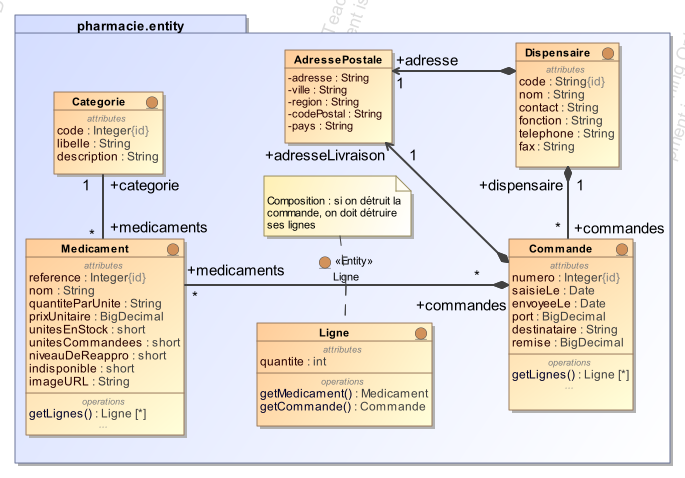
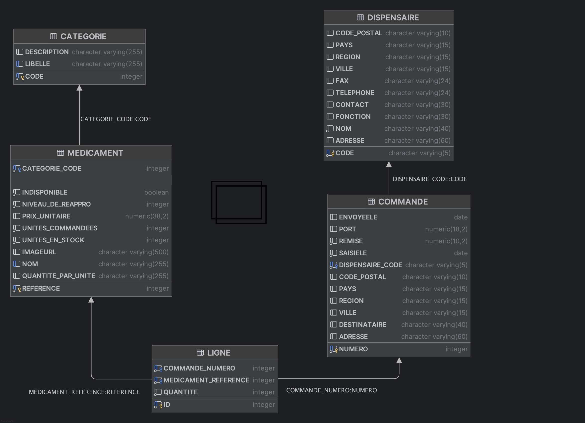

# Spring Boot Application - Gestion Pharmaceutique

## Description
Ce projet est une application Spring Boot destinée à une pharmacie centrale qui permet à des dispensaires de commander des médicaments. L'API fournie comprends la gestion des médicaments et des commandes pour les dispensaires. Elle utilise des entités JPA pour interagir avec une base de données, des services REST exposés via des contrôleurs, et des dépôts pour accéder aux données.

## Fonctionnalités
- Gestion des médicaments, dispensaires, commandes et catégories de médicaments.
- Suivi des statistiques de commandes par catégorie de médicaments.
- Exposition des données via des services REST en JSON et XML.
- Utilisation de Spring Data JPA pour accéder et manipuler les données.

## Modèles de données

Le *modèle conceptuel de données* (UML/JPA) est le suivant :



Spring Data JPA va générer automatiquement le *modèle logique de données* (relationnel) suivant, conformément aux annotations des classes-entités :



## Structure du Code
### Couche "Accès aux données"
#### Entités
Les entités représentent les tables de base de données et leur mapping avec JPA.

- [Medicament](src/main/java/comptoirs/entity/Medicament.java): Représente les médicaments avec leurs informations (nom, prix, stock, image URL).
- [Dispensaire](src/main/java/comptoirs/entity/Dispensaire.java): Représente les établissements de santé qui passent commande.
- [Commande](src/main/java/comptoirs/entity/Commande.java): Représente les commandes de médicaments.
- [Ligne](src/main/java/comptoirs/entity/Ligne.java): Représente les lignes de commande (médicament + quantité).
- [Categorie](src/main/java/comptoirs/entity/Categorie.java): Représente les catégories de médicaments.

#### Dépôts (Repositories)
Les dépôts gèrent l'accès aux entités via Spring Data JPA.

- [MedicamentRepository](src/main/java/comptoirs/dao/MedicamentRepository.java): Interface gérant les requêtes sur les entités `Medicament`.
- [DispensaireRepository](src/main/java/comptoirs/dao/DispensaireRepository.java): Interface gérant les requêtes sur les entités `Dispensaire`.
- [CommandeRepository](src/main/java/comptoirs/dao/CommandeRepository.java): Interface gérant les requêtes sur les entités `Commande`.
- [LigneRepository](src/main/java/comptoirs/dao/LigneRepository.java): Interface gérant les requêtes sur les entités `Ligne`.

### Couche "Services métier"

Cette couche définit les services métier transactionnels qui utilisent la couche "Accès aux données" pour effectuer des opérations complexes.

- [CommandeService](src/main/java/comptoirs/service/CommandeService.java): Gère les commandes de médicaments en assurant le respect des règles métier (vérification des stocks, calcul des totaux, gestion des dispensaires).


### Couche "Web"
#### Contrôleurs REST
Les contrôleurs exposent les points d'entrée REST pour interagir avec l'application.

- [CommandeController](src/main/java/comptoirs/rest/CommandeController.java): Fournit une API web permettant l'accès au service métier [CommandeService](src/main/java/comptoirs/service/CommandeService.java).
- [StatisticsRestController](src/main/java/comptoirs/rest/StatisticsRestController.java): Fournit des statistiques sur les médicaments par catégorie.
- [SimpleRestController](src/main/java/comptoirs/rest/SimpleRestController.java): Fournit des endpoints simples pour interroger les catégories, médicaments et dispensaires.
- une [API de télechargement d'images](doc/API_UPLOAD_IMAGE.md) est fournie pour renseigner les images des médicaments
- L'application esn configurée pour permettre l'[accès Cross-Origin (CORS)](doc/CORS_CONFIGURATION.md) depuis n'importe quelle origine.

#### Contrôleurs MVC
- [StatsMVCController](src/main/java/comptoirs/mvc/StatsMVCController.java): Fournit des vues HTML avec Thymeleaf pour les statistiques.

#### Documentation API
L'application expose sa documentation OpenAPI/Swagger à l'adresse : `http://localhost:8989/swagger-ui.html`

## Technologies Utilisées
- **Java 21 LTS**
- **Spring Boot 3.5.3**
- **Spring Data JPA** avec Hibernate 6.6.18
- **Jakarta EE** (Jakarta Persistence API 3.1.0)
- **Lombok 1.18.42**
- **SpringDoc OpenAPI 2.7.0** pour la documentation API
- **H2 Database 2.3.232** (développement)
- **PostgreSQL 42.7.7** (production)

## Démarrage de l'application

### Prérequis
- Java 21 LTS installé
- Maven 3.6+

### Lancer l'application
```bash
mvn clean spring-boot:run
```

L'application démarre sur le port **8989** : `http://localhost:8989`

### Accéder à la documentation API
Une fois l'application démarrée, accédez à Swagger UI :
```
http://localhost:8989/swagger-ui.html
```

### Données de test
L'application charge automatiquement des données de test au démarrage :
- **10 catégories** de médicaments (Antalgiques, Anti-inflammatoires, Antibiotiques, etc.)
- **100 médicaments** (10 par catégorie) avec URLs d'images Unsplash
- **10 dispensaires** situés au Sénégal (Dakar, Saint-Louis, Thiès, etc.)
- **8 commandes** avec lignes de commande

## Documentation
Consultez la documentation officielle pour mieux comprendre les technologies utilisées dans ce projet :

- **[Spring Boot 3.x Documentation](https://docs.spring.io/spring-boot/docs/current/reference/html/)**: Documentation complète de Spring Boot.
- **[Spring Data JPA](https://docs.spring.io/spring-data/jpa/reference/)**: Documentation sur l'intégration de JPA avec Spring.
- **[Jakarta Persistence](https://jakarta.ee/specifications/persistence/3.1/)**: Spécification Jakarta Persistence API 3.1.
- **[SpringDoc OpenAPI](https://springdoc.org/)**: Documentation pour SpringDoc OpenAPI.

## Guides Utiles
Voici des tutoriels pour démarrer avec les technologies Spring utilisées dans ce projet :

- **[Accessing Data with JPA](https://spring.io/guides/gs/accessing-data-jpa/)**: Accès aux données avec Spring Data JPA.
- **[Building a RESTful Web Service](https://spring.io/guides/gs/rest-service/)**: Création d'un service web RESTful avec Spring Boot.
